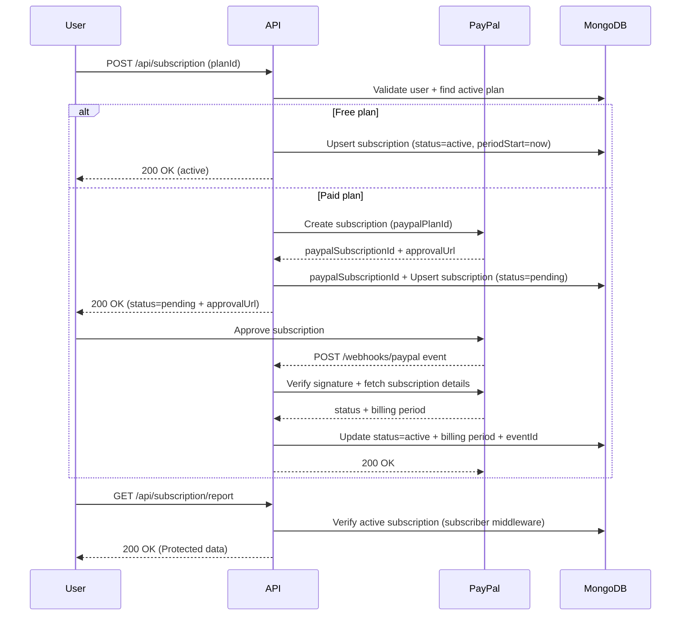

# Subscription Billing API

Production-style backend API that simulates a real SaaS subscription system.

This project demonstrates how a modern backend handles:
- authentication with token rotation
- role-based access control (admin vs user)
- recurring billing via PayPal Subscriptions API
- secure webhook processing with signature verification
- idempotent event handling
- subscription-gated API access

The project is intentionally backend-only and designed to be consumed by any frontend (React, mobile, etc.).

## Tech Stack
- Node.js
- Express
- MongoDB + Mongoose
- JWT (access + refresh token)
- Joi validation
- bcrypt (password and refresh-token hashing)
- PayPal REST API (Sandbox)
- Jest + Supertest + mongodb-memory-server

## Features
- User registration and admin creation
- Login, refresh token rotation, logout (httpOnly cookie)
- Admin-only plan CRUD (soft delete)
- Subscription checkout:
  - Free plan: activate immediately
  - Paid plan: create PayPal subscription and set pending status
- Subscriber-only endpoint (`/api/subscription/report`)
- PayPal webhook handler with signature verification + idempotency (eventId)

## Subscription Flow Diagram


## Project Structure
```bash
src/
  app.js
  middleware/
  models/
  routes/
  services/
  utils/
tests/
index.js
```

## Environment Variables
Create `.env` in project root:
```env
PORT=3000
MONGO_URI=mongodb://127.0.0.1:27017/subscription_db

ACCESS_TOKEN_JWT_KEY=your_access_secret
REFRESH_TOKEN_JWT_KEY=your_refresh_secret

PAYPAL_BASE_URL=https://api-m.sandbox.paypal.com
PAYPAL_CLIENT_ID=your_paypal_client_id
PAYPAL_CLIENT_SECRET=your_paypal_client_secret
PAYPAL_PRODUCT_ID=PROD-XXXXXXXXXXXX
PAYPAL_WEBHOOK_ID=WH-XXXXXXXXXXXX
PAYPAL_RETURN_URL=https://your-ngrok-domain.ngrok-free.app/success
PAYPAL_CANCEL_URL=https://your-ngrok-domain.ngrok-free.app/cancel
PAYPAL_CURRENCY=EUR
```

## Run Locally
```bash
npm install
node index.js
```
Server runs on `http://localhost:3000` (or `PORT` from `.env`).

## Initial Setup Order (Important)
Before using the full flow (especially paid plans), do this once:

1. Create first admin account
```bash
node src/scripts/seedAdmin.js
```

2. Login as admin and create PayPal Product
```http
POST /api/paypal/product/init
```

Copy returned `productId` (format `PROD-...`) into `.env`:
```env
PAYPAL_PRODUCT_ID=PROD-XXXXXXXXXXXX
```

3. Restart server after updating `.env`
```bash
node index.js
```

Then you can continue with normal flow:
- Create admin/user
- Create plan (`free` or paid)
- Checkout subscription
- Process webhook updates

Note:
- `PAYPAL_PRODUCT_ID` is required for paid plan flow.
- Free plan can still work without PayPal Product.

## API Overview
### Auth
- `POST /api/auth/login`
- `POST /api/auth/refresh`
- `POST /api/auth/logout`

### User
- `POST /api/user`
- `POST /api/user/admin` (admin only)

### Plan
- `POST /api/plan` (admin only)
- `GET /api/plan`
- `GET /api/plan/all` (admin only)
- `PATCH /api/plan/:planId` (admin only)
- `DELETE /api/plan/:planId` (admin only, soft delete)

### Subscription
- `POST /api/subscription`
- `GET /api/subscription/me`
- `GET /api/subscription/report` (active subscriber only)

### PayPal
- `POST /api/paypal/product/init` (admin only)
- `POST /webhooks/paypal` (listener endpoint triggered automatically by PayPal webhook events - not called manually).

## Local Webhook Testing (ngrok)
Use ngrok to expose your local server so PayPal can send webhook events to your machine.

```bash
ngrok http 3000
```

ngrok gives forwarding a URL like:

```text
https://your-subdomain.ngrok-free.app -> http://localhost:3000
```

then set:

```env
PAYPAL_RETURN_URL=https://your-subdomain.ngrok-free.app/success
PAYPAL_CANCEL_URL=https://your-subdomain.ngrok-free.app/cancel
```

and configure your PayPal webhook URL to:

```text
https://your-subdomain.ngrok-free.app/webhooks/paypal
```

## End-to-End Manual Test Flow

1. Create admin user
2. Initialize PayPal product (admin):
   POST /api/paypal/product/init

3. Create paid plan (admin):
   POST /api/plan

4. Login as normal user:
   POST /api/auth/login

5. Checkout subscription:
   POST /api/subscription

6. Open `approvalUrl` and approve using PayPal Sandbox personal account.

7. PayPal sends webhook -> subscription becomes ACTIVE in MongoDB.

8. Access protected endpoint:
   GET /api/subscription/report

## Sample Webhook Payload
Example payload shape received by `POST /webhooks/paypal`:

```json
{
  "id": "WH-EXAMPLE123",
  "event_type": "BILLING.SUBSCRIPTION.ACTIVATED",
  "resource": {
    "id": "I-EXAMPLE_SUBSCRIPTION_ID"
  }
}
```

For subscription creation, PayPal can send:

```json
{
  "id": "WH-EXAMPLE124",
  "event_type": "BILLING.SUBSCRIPTION.CREATED",
  "resource": {
    "id": "I-EXAMPLE_SUBSCRIPTION_ID",
    "status": "APPROVAL_PENDING"
  }
}
```

For `PAYMENT.SALE.*` events, PayPal can send:

```json
{
  "id": "WH-EXAMPLE456",
  "event_type": "PAYMENT.SALE.COMPLETED",
  "resource": {
    "billing_agreement_id": "I-EXAMPLE_SUBSCRIPTION_ID",
    "id": "SALE-EXAMPLE_ID"
  }
}
```

## Postman Collection
Click the button below and choose **Fork Collection** to copy all requests into your Postman workspace.

[](https://app.getpostman.com/run-collection/51955828-32990454-69eb-4df3-9fea-95f1e344051c?action=collection%2Ffork&source=rip_markdown&collection-url=entityId%3D51955828-32990454-69eb-4df3-9fea-95f1e344051c%26entityType%3Dcollection%26workspaceId%3D0c68e6a5-9325-4e21-80aa-4c6127511151)

Create a Postman environment and add the following variables:
- `baseUrl` = `http://localhost:3000`
- `accessToken` = leave empty (Automatically set after login)
- `freePlanId` = leave empty (auto-filled after creating Free plan)
- `proPlanId` = leave empty (auto-filled after creating Pro plan)
- `goldPlanId` = leave empty (auto-filled after creating Gold plan)

## Testing
Run all tests:
```bash
npm test
```

Run coverage:
```bash
npm run test:coverage
```

As of last run:
- 11 test suites
- 53 tests
- All passing

## Notes / Trade-offs
- Webhook idempotency uses eventId check + save.
- Production-hardening next steps:
  - Atomic idempotency lock/state machine
  - Retry strategy for failed webhook processing
  - More unit tests for PayPal service modules

## Product roadmap / next features
- Plan versioning (if price/billingCycle changes)
- Upgrade/downgrade plan flow
- Cancel subscription API (call PayPal + update DB)
